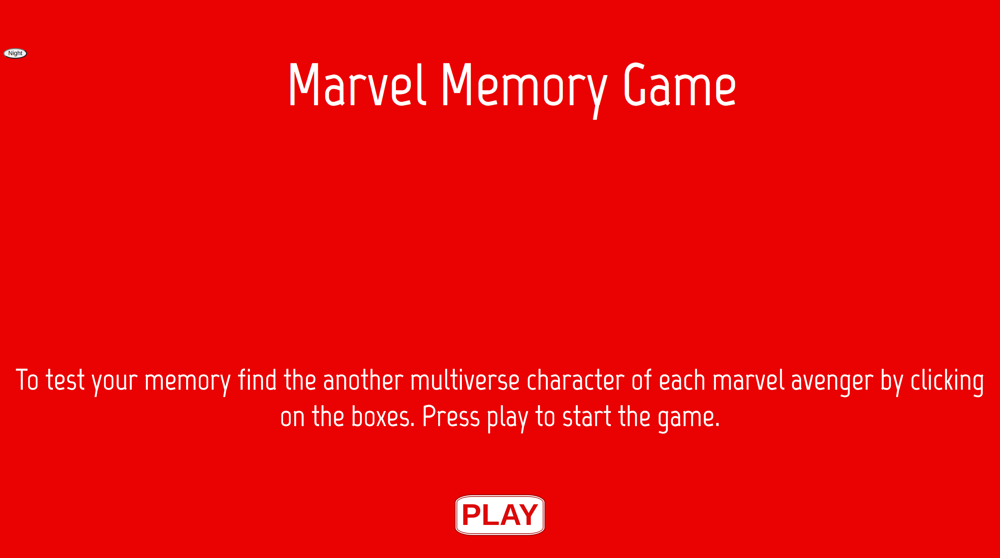
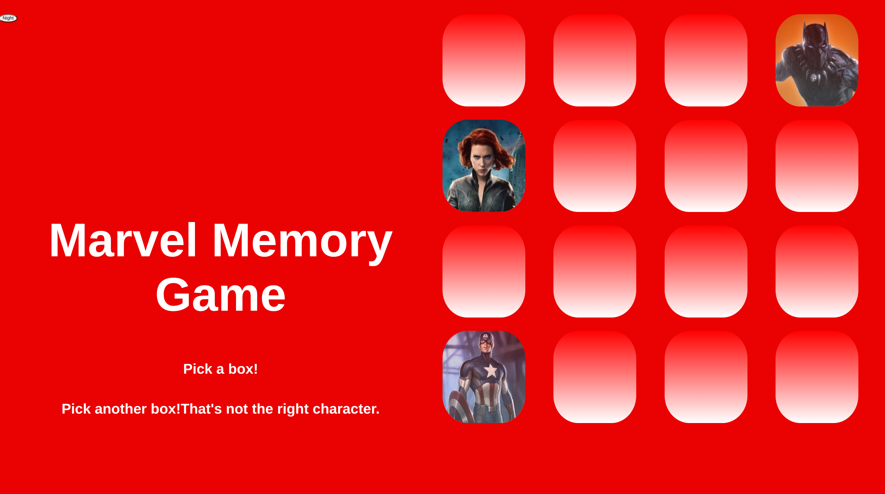

# Memory Game

#### Date 7/3/2022

### By Maham Almizan Khan

### Links to accounts

[Facebook](https://www.facebook.com/) | [Trello](https://trello.com/b/1TZAQYYq/unit-1-project-memory-game) |[Linkdin](https://www.linkedin.com/)

---

### **_Description_**

#### Test your memory with boxes in a time limit.

---

### **_Technologies Used_**

- HTML
- CSS
- JavaScript

---

### **_How to get started_**

Read the instruction on the homepage and select option to get started.

---

### **_Post MVP_**

1. Add timer
2. make the images shuffle everytime

### **Screenshots**

---

### Sources

- [Images](https://www.google.com/?&bih=839&biw=1500&hl=en)
- [Markdown Cheatsheet](https://www.markdownguide.org/cheat-sheet/)
- [classList](https://stackoverflow.com/questions/6787383/how-to-add-remove-a-class-in-javascript)
- [background-image](https://www.w3schools.com/cssref/pr_background-position.asp)
- [background-repeat](https://www.w3schools.com/cssref/pr_background-position.asp)
- [time](https://developer.mozilla.org/en-US/docs/Web/API/setTimeout)
- [CSS](https://generalassembly.zoom.us/rec/play/yTHGaK6y5b2NHIBIZo02YRHEBTVnNupsIKeJmVfAd1_STbFIksEDt_ciBxcxjK_5_eLdoexTp3PwpQJR.akJLLtiQm-glV2gZ?continueMode=true&_x_zm_rtaid=1Q3671oLS6OJoPJUzRFQ7A.1657198818145.ef9143e98539af09f156c4966852bfae&_x_zm_rhtaid=641)
- [dark-mode](https://www.geeksforgeeks.org/how-to-make-dark-mode-for-websites-using-html-css-javascript/)
- [timer](https://www.w3schools.com/howto/howto_js_countdown.asp)
